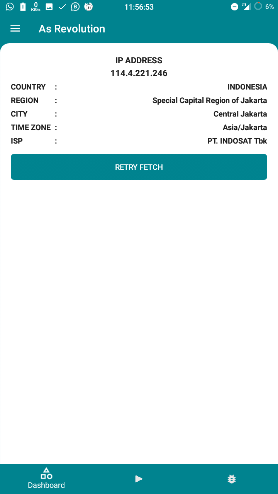
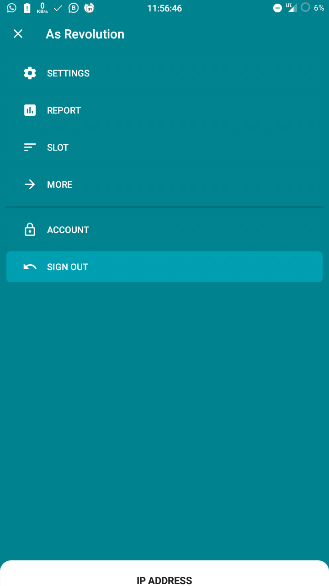
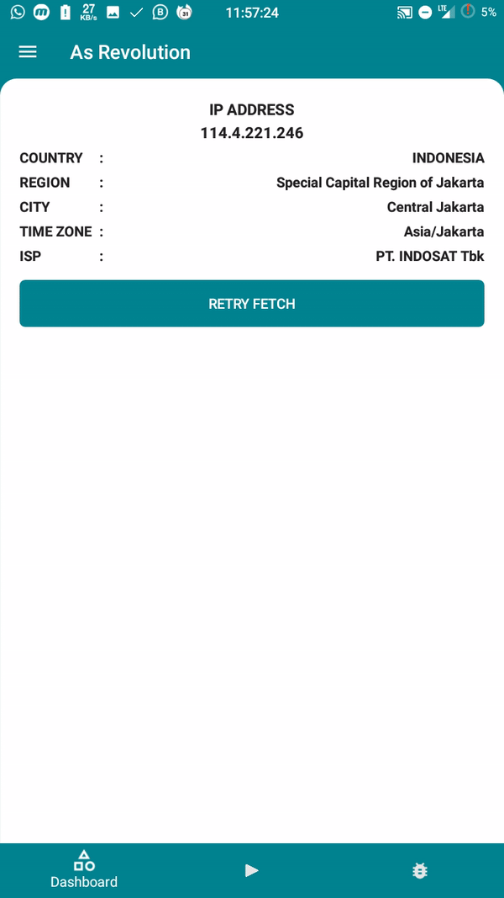

[](https://jitpack.io/#syaikhanagil/revBackDrop)
## revBackDrop
Easy Material Backdrop Library
###### Based of Material Design [Backdrop](https://material.io/design/components/backdrop.html)
-----
### Preview
 ** **  ** ** 


## Install

##### Include the `revBackDrop` dependency in app's **build.gradle** and you are good to go.

```groovy
implementation 'com.github.syaikhanagil.revBackDrop:1.2'
```
or
```groovy
compile 'com.github.syaikhanagil.revBackDrop:1.2'
```

### Usage
1. Include in your layout
```java
<android.support.v7.widget.Toolbar
	android:theme="@style/AppTheme.AppBarOverlay"
	android:id="@+id/ToolbarID"
	android:layout_width="match_parent"
	android:layout_height="?attr/actionBarSize"
	app:popupTheme="@style/AppTheme.PopupOverlay" 
	android:background="@color/colorPrimary"/>

<net.syaikhanagil.androidlabs.backdrop.dropContainer
	android:id="@+id/DropContainerID"
	android:layout_below="@id/ToolbarID"
	android:layout_height="match_parent"
	android:layout_width="match_parent"
	app:dropMenuIcon="@drawable/ic_drop_menu"
	app:dropCloseIcon="@drawable/ic_drop_close"
	app:duration="100">

	<!-- Is Front Layout -->
	<include layout="@layout/layout_main"/>

	<!-- Is Back Layout -->
	<include layout="@layout/layout_menu"/>

</net.syaikhanagil.androidlabs.backdrop.dropContainer>
```

 * Notice : The container can only be used for two child layout

#### If you own cosumize icon, you can change this attribute at the layout usage.
```java
app:dropMenuIcon="@drawable/ic_drop_menu" // Before clicked

app:dropCloseIcon="@drawable/ic_drop_close" // After child dropped or Icon clicked
```

##### Vector for Close and Menu Icon (Optional)

**ic_drop_menu.xml**
```java
<vector xmlns:android="http://schemas.android.com/apk/res/android"
    android:width="24dp"
    android:height="24dp"
    android:viewportWidth="24"
    android:viewportHeight="24">
    <path
	android:fillColor="#ffffff"
	android:pathData="M3,18h18v-2L3,16v2zM3,13h18v-2L3,11v2zM3,6v2h18L21,6L3,6z"/>
</vector>
```

**ic_drop_close.xml**
```java
<vector xmlns:android="http://schemas.android.com/apk/res/android"
    android:width="24dp"
    android:height="24dp"
    android:viewportWidth="24"
    android:viewportHeight="24">
    <path
	android:fillColor="#ffffff"
	android:pathData="M19,6.41L17.59,5 12,10.59 6.41,5 5,6.41 10.59,12 5,17.59 6.41,19 12,13.41 17.59,19 19,17.59 13.41,12z"/>
</vector>
```

4. Add this in **values/dimens.xml**
```java
<dimen name="drop_height">120dp</dimen>
```

5. in your Activity onCreate Method
```java
Toolbar mToolbar = (Toolbar) findViewById(R.id.ToolbarID);
dropContainer = (dropContainer) findViewById(R.id.DropContainerID);
int droppedHeight = this.getResources().getDimensionPixelSize(R.dimen.drop_height);
dropContainer.attachToolbar(mToolbar).dropInterpolator(new LinearInterpolator()).dropHeight(droppedHeight).createDrop();
```


### ChangeLog

#### v1.2
 * Gradle Error Fixed
 * Added Api 16+ Support

#### v1.1
 * Crash Fixed
 * Added Api 17+ Support

#### v1.0
 * Initial Release

## License
```
MIT License

Copyright (c) 2019 Syaikhan Agil

Permission is hereby granted, free of charge, to any person obtaining a copy
of this software and associated documentation files (the "Software"), to deal
in the Software without restriction, including without limitation the rights
to use, copy, modify, merge, publish, distribute, sublicense, and/or sell
copies of the Software, and to permit persons to whom the Software is
furnished to do so, subject to the following conditions:

The above copyright notice and this permission notice shall be included in all
copies or substantial portions of the Software.

THE SOFTWARE IS PROVIDED "AS IS", WITHOUT WARRANTY OF ANY KIND, EXPRESS OR
IMPLIED, INCLUDING BUT NOT LIMITED TO THE WARRANTIES OF MERCHANTABILITY,
FITNESS FOR A PARTICULAR PURPOSE AND NONINFRINGEMENT. IN NO EVENT SHALL THE
AUTHORS OR COPYRIGHT HOLDERS BE LIABLE FOR ANY CLAIM, DAMAGES OR OTHER
LIABILITY, WHETHER IN AN ACTION OF CONTRACT, TORT OR OTHERWISE, ARISING FROM,
OUT OF OR IN CONNECTION WITH THE SOFTWARE OR THE USE OR OTHER DEALINGS IN THE
SOFTWARE.
```
